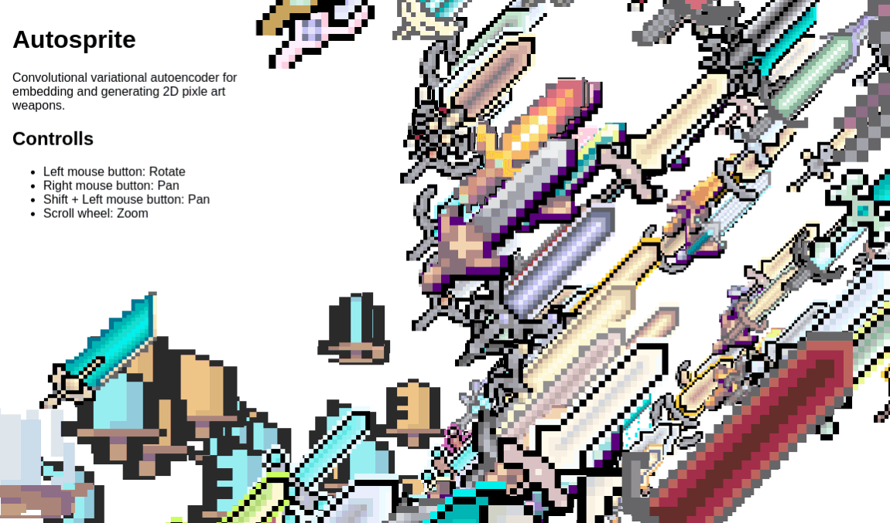
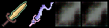
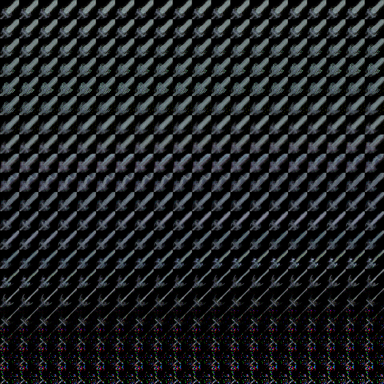

# 🤖 auto - sprite

An experiment in a chain of project to make ai generated game assets.  
This project was trained on 700 scraped and custom curated images

  
[Check it out here]()

## Findings

### Shapes and colors

Models quickly learned the shapes of the swords, but struggled with color. It never really got to the point where vividly colored items were generated. Since All items had a different base color, model figured out that the basic gray ish color leads to the best results. This issue didnt go away even when i tried to overfit the model or give it excessive latent space.

Examples from traing 0 and 25 epochs:  
  

### Generation capabilities

Model was capable of generating quite noticable shapes but struggled with any real detail or creativity. It was also not able to generate any new shapes, only ones it had seen before. This is probably due to the fact that the dataset was quite small and we've overfitted the model.

We have tried a single value embedding and a 2 value embedding, giving us a line and a matrix of sword shapes, respectively. Results are shown here. 

**Single value**
  
**2d embedding**
  

My guess is, that the noise at higher numbers is due to activations having most precision near midpoint. This does not explain why the lower end of the spectrum is not noisy, but it is the best explanation I have.

## future plans

I'll try to use a simmilar approach on other images. Currently im planning on using it for crypto currency icons. i'd like to be able to cluster simmilar looking ones together and generate new ones

I am planning on retrying this same idea with a GAN, but that is a distant future plan.

## Thanks

- [Zan Oberstar](https://github.com/gendestry) for the compute power, 🍺 and debugging help.
- [Enei Sluga](https://github.com/smufa) for help with the dataset, ideas and support. *#embedeverything*
